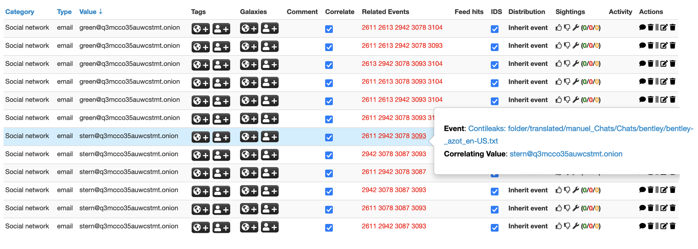

# pymispconti

A python script to process unstructured files into MISP by regex extracting interesting features, including:

- Bitcoin addresses
- IPv4 addresses
- Email addresses

Pre-requisites:
[MISP](https://github.com/MISP/misp-docker), [Tika](https://hub.docker.com/r/apache/tika)

Update the following before use...

MISP settings:

- MISP_URL
- MISP_KEY
- MISP_VERIFYCERT

Tika settings:

- TIKA_PORT
- TIKA_HOST

Example usage:

`python pymispconti.py folder out.csv`

CSV output after running extraction on recent Conti leaks: [csv](./out.csv)

Example of correlation graph within MISP:

Example attribute search for stern@q3mcco35auwcstmt.onion and green@q3mcco35auwcstmt.onion within MISP:

